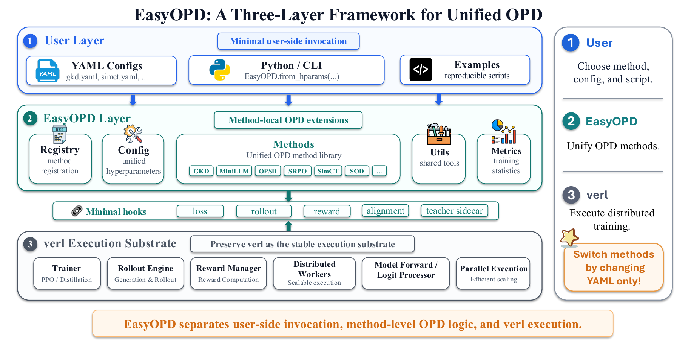

# EasyOPD: An Easy-to-use On-Policy Distillation Framework for Large Language Models

<p align="center">
  <a href="https://arxiv.org/abs/xxxx.xxxxx"></a>
  <a href="https://github.com/lds-ustc/EasyOPD"></a>
  <a href="#quick-start"></a>
  <a href="LICENSE"></a>
</p>

<p align="center">
  <a href="https://drive.google.com/file/d/1hgUeViTfSLEkAjsnj76PdLlgkBHRO-TS/view?usp=sharing">
    <br>
    
  </a>
</p>
<p align="center"><sub>Click the image above to watch a short walkthrough of EasyOPD (hosted on Google Drive).</sub></p>


**EasyOPD** is a unified, method-oriented framework for **On-Policy Distillation (OPD)** built on top of
[verl](https://github.com/verl-project/verl). OPD methods differ widely in supervision form, tokenizer
compatibility, teacher access, and supervision granularity, which usually leads to fragmented, hard-to-reproduce
implementations. EasyOPD separates **user-side configuration**, **method-local supervision logic**, and
**verl-based distributed execution**, so that heterogeneous OPD methods share one execution backend and are
selected by simply switching a YAML config.

The framework instantiates representative methods across three settings — **cross-tokenizer OPD**,
**on-policy self-distillation**, and **step-wise OPD** — together with their baselines, and its extension
boundaries are designed to accommodate additional supervision forms (e.g. black-box / rubric-based feedback).

---

## Table of Contents

- [Architecture](#architecture)
- [Installation](#installation)
- [Quick Start](#quick-start)
- [Configuring Secrets and Paths (`.env`)](#configuring-secrets-and-paths-env)
- [Supported Methods](#supported-methods)
- [Reproducing the Paper Experiments](#reproducing-the-paper-experiments)
- [Adding a New Method](#adding-a-new-method)
- [Project Structure](#project-structure)
- [Citation](#citation)
- [License](#license)

---

## Architecture

EasyOPD adopts a three-layer design:

```
┌──────────────────────────────────────────────────────────────────┐
│  User Layer      YAML config + Python/CLI entry points             │
│                  EasyOPD.from_hparams("simct")  |  bash run_*.sh    │
├──────────────────────────────────────────────────────────────────┤
│  EasyOPD Layer   Registry · Config · Method-local supervision      │
│                  Thin hooks: loss · rollout · reward · alignment ·  │
│                  teacher-sidecar  +  supervision diagnostics        │
├──────────────────────────────────────────────────────────────────┤
│  verl Layer      Distributed rollout · FSDP/Megatron · vLLM/SGLang  │
│                  PPO/GRPO trainer · reward · optimization           │
└──────────────────────────────────────────────────────────────────┘
```

Users select a method through configuration; developers add a method by registering a method-local module with
the hooks it needs, so the core trainer and workers reach method-specific supervision only through the shared
dispatch layer. See Figure 1/2 of the paper for details.

---

## Installation

Requires **Python 3.11, CUDA 12.4, 8×GPU (H20 96GB validated)**. See [`requirements.txt`](requirements.txt) for
pinned versions.

```bash
git clone https://github.com/lds-ustc/EasyOPD.git
cd EasyOPD

# torch / flash-attn / vLLM / sglang need dedicated index URLs, so prefer the
# one-click installer over a bare `pip install -r requirements.txt`:
bash scripts/install_easyopd_env.sh

# EasyOPD is provided in-repo; add it to PYTHONPATH (the launch scripts also do this):
export PYTHONPATH="$(pwd):${PYTHONPATH}"
```

> `import easyopd` and `import verl` both resolve to this repository.

---

## Quick Start

### 1. Discover methods (Python API)

```python
from easyopd import EasyOPD

print(EasyOPD.list_methods())
# ['alm', 'dskd', 'echo_kd', 'g_opd', 'gad', 'gkd', 'lightning_opd', 'opcd',
#  'opsa', 'ropd', 'sdpo', 'sft', 'simct', 'simple', 'sod', 'uld', 'vision_opd']

# Load any method by name + YAML — only the name and config change:
simct = EasyOPD.from_hparams("simct", config_path="easyopd/config/simct.yaml", auto_resolve_data=False)
sdpo  = EasyOPD.from_hparams("sdpo",  config_path="easyopd/config/sdpo.yaml",  auto_resolve_data=False)
sod   = EasyOPD.from_hparams("sod",   config_path="easyopd/config/sod.yaml",   auto_resolve_data=False)
```

### 2. Interactive demo notebook

A short walkthrough of the unified entry point and the three settings, with real diagnostics from finished runs:

```bash
jupyter notebook examples/demo/demo.ipynb
```

> The first `list_methods()` call imports all method modules and can take ~2 minutes; subsequent calls are
> instant. The notebook derives all paths from the installed `easyopd` package, so it runs from any working
> directory.

### 3. Launch training

Each method (and its baselines) has a single launch script. The config selects the method and the hooks it
activates:

```bash
# Cross-tokenizer OPD  (SimCT; baselines: uld | alm | dskd)
bash examples/simct/run_simct.sh

# On-policy self-distillation  (SDPO; baseline: grpo)
bash examples/sdpo/run_sdpo.sh

# Step-wise OPD  (SOD; needs a code-execution sandbox — see .env below)
bash examples/sod/run_sod.sh
```

You can also use the unified CLI:

```bash
python scripts/run_easyopd.py --list-methods
python scripts/run_easyopd.py --method simct --config easyopd/config/simct.yaml
python scripts/run_easyopd.py --method sod --dry-run   # validate config without training
```

---

## Configuring Secrets and Paths (`.env`)

Machine-specific values (a code-execution sandbox endpoint, model/data roots, W&B key) are **not** committed.
Copy the template and fill in your own values:

```bash
cp .env.example .env
# then edit .env, e.g.:
#   SANDBOX_FUSION_URL="https://<your-sandbox-endpoint>/run_code"
#   WANDB_API_KEY=...
```

`.env` is git-ignored. The SOD / agentic launch scripts source it automatically and fall back to a placeholder
when a value is unset. Model and dataset paths in the launch scripts (`STUDENT_MODEL`, `TEACHER_MODEL`,
`DATASET_DIR`, …) are set to `/path/to/...` placeholders — edit them to point at your local checkpoints and data.

---

## Supported Methods

Representative methods (evaluated in the paper) are in **bold**; the rest share the same interface.

| Method | Setting | Teacher | Key idea |
|--------|---------|---------|----------|
| **simct** | Cross-tokenizer OPD | External (different tokenizer) | Span-based virtual-vocabulary logits |
| uld | Cross-tokenizer OPD | External | Universal logit distillation |
| alm | Cross-tokenizer OPD | External | Adaptive logit matching |
| dskd | Cross-tokenizer OPD | External | Dual-space knowledge distillation |
| simple | Cross-tokenizer OPD | External | Overlap-vocabulary KL with char-level alignment |
| **sdpo** | On-policy self-distillation | Self (EMA + reprompt) | Self-distillation from high-reward trajectories |
| **sod** | Step-wise OPD | External | Step-level adaptive re-weighting for tool-use agents |
| gkd | Standard OPD | External (same tokenizer) | Generalized JSD with on-policy sampling |
| g_opd | Generalized OPD | External + context | Reward extrapolation + flexible reference |
| opcd | Context distillation | Self (context-conditioned) | Experience injection + KL minimization |
| opsa / ropd / vision_opd / … | Additional settings | — | See per-method notes under `easyopd/methods/` |

`grpo` (standard RL, no distillation) is provided as a baseline in each experiment directory.

---

## Reproducing the Paper Experiments

The paper's three case studies live under `experiments/`, each with per-method `launch.sh` scripts that prepare
data, (re)start Ray, train, merge checkpoints, and evaluate:

```bash
# Cross-tokenizer OPD (SimCT vs. ULD / ALM / DSKD), Qwen2.5-7B → Phi-4-mini
bash experiments/01_cross_tokenizer_opd/methods/simct/launch.sh

# On-policy self-distillation (SDPO vs. GRPO), Qwen3-8B
bash experiments/04_self_opd/methods/sdpo/launch.sh

# Step-wise OPD (SOD vs. response-level OPD / GRPO), Qwen3-1.7B student
bash experiments/02_agentic_opd/methods/sod/launch.sh
```

Edit the model/data paths at the top of each script (or export them as env vars) before running. Evaluation
results are written under each method's local `results/` directory (git-ignored).

---

## Adding a New Method

1. Create `easyopd/methods/your_method/` and implement the algorithm in `core.py`.
2. Implement the hook adapters you need in `hooks.py` (loss / rollout / reward / alignment / teacher-sidecar).
3. Register it in `__init__.py`:

```python
from easyopd.registry import register_method

@register_method("your_method")
class YourMethod:
    name = "your_method"
    description = "Your OPD method"
    paper_url = "https://arxiv.org/abs/..."
```

4. Add a default config `easyopd/config/your_method.yaml`.

The core trainer and workers need no per-method branches — supervision is reached only through the shared hooks.
See [CONTRIBUTING.md](CONTRIBUTING.md).

---

## Project Structure

```
EasyOPD/
├── easyopd/                 # Unified interface layer
│   ├── __init__.py          #   EasyOPD.from_hparams() / list_methods()
│   ├── registry.py          #   @register_method
│   ├── config/              #   default YAML per method (simct.yaml, sdpo.yaml, sod.yaml, ...)
│   └── methods/             #   method-local implementations (simct, sdpo, sod, ...)
├── verl/                    # verl backend (minimal, comment-bracketed EasyOPD hooks)
├── examples/                # per-method launch scripts + demo notebook (examples/demo/)
├── experiments/             # paper case studies (01_cross_tokenizer_opd, 02_agentic_opd, 04_self_opd, ...)
├── scripts/                 # run_easyopd.py / run_easyopd.sh / install_easyopd_env.sh
├── .env.example             # template for local secrets/paths (copy to .env)
├── requirements.txt
└── README.md
```

---

## Citation

```bibtex
@article{easyopd2026,
  title={EasyOPD: An Easy-to-use On-Policy Distillation Framework for Large Language Models},
  author={Sun, Jie and Zheng, Mao and Song, Mingyang and Zhong, Qiyong and Li, Gengsheng and Hong, Zhepei and Wu, Chang and Liu, Pengfei and Fang, Junfeng and Wang, Xiang},
  journal={arXiv preprint arXiv:xxxx.xxxxx},
  year={2026}
}
```

---

## Acknowledgments

EasyOPD is built on top of [verl](https://github.com/verl-project/verl). We thank the verl team and the authors
of all integrated OPD methods. The original verl documentation is preserved in
[`README_VERL.md`](README_VERL.md).

---

## License

Apache License 2.0. See [LICENSE](LICENSE).
